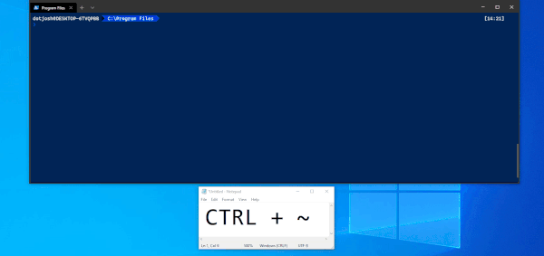
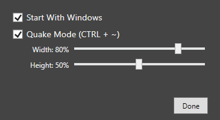

## WinTermPlus

Coming from conemu, I wanted a way to have a global shortcut for showing/hiding the new Windows Terminal.  This is that project.

Any other good ideas to improve Windows Terminal (that aren't being done officially) could be added here.

* Runs in system tray
* Quake-Mode (CTRL+~) global shortcut to minimize/restore Windows Terminal
	* Adjust window width/height

